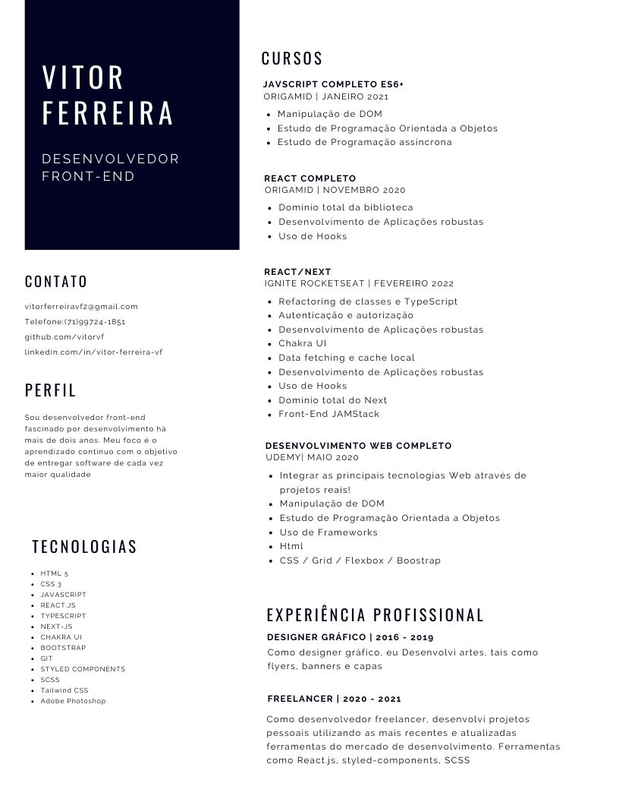

<a href="https://github.com/vitorvf"> <h1 align="center"> Vitor Ferreira </h1> </a>

<table align="center" style="width:100%">

  <tr>
    <th align="center">
      <b align="center" text-align="center"> Email </b>
    </th>
    <th align="center">
      <b align="center" text-align="center"> Linkedin </b>
    </th>
    <th align="center">
      <b align="center" text-align="center"> Portfólio </b>
    </th>
   
  </tr>

  <tr>
    <td align="center">
      
 
        
      

    </td>
    <td align="center">
      

        
      

    </td>
    <td align="center">
      

        
      

    </td>
 
    
  
  </tr>

  <tr>
    <td align="center">
      <a align="center" href="mailto:vitorferreiravf2@gmail.com">  vitorferreiravf2  </a>
    </td>
    <td align="center">
      <a align="center" href="https://www.linkedin.com/in/vitor-ferreira-vf/">  Vitor Ferreira  </a>
    </td>
    <td align="center">
<a align="center" href="https://vitorferreira.netlify.app/">  Vitor Ferreira - Portfólio  </a>    </td>
    
  </tr>
  </table>
  

 

  
 
       

      <a href="https://github.com/vitorvf">
      
      
    

  

    
 
   

   <h2 align="center"> Tecnologias: </h2>                          
   
 <a href="#" disabled=""> 
    
    
   
   
   
   
   
    
    
   
   
   
   
    
   
        

         
## Currículo:

  

 
 
 
  
 

    
